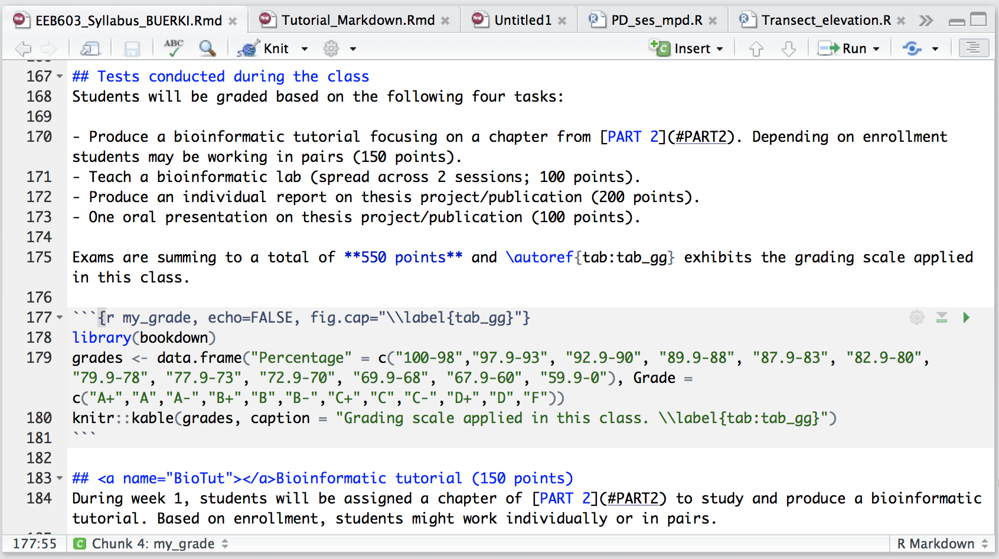

\newpage

```{r setup, include=FALSE}
knitr::opts_chunk$set(fig.pos = 'H')
```

# Learning outcomes

This tutorial is devoted to part B of chapter 1 and provides students with opportunities to learn procedures to:

- Insert tables and figures in R Markdown document. 
- Cross-reference tables and figures in the text.
- Cite references in the text and add a bibliography/references section.
- Format citations to journal styles.

# Associated files supporting this tutorial

Although less used in part A, a set of files are provided to support teaching of material presented in this chapter. These files are deposited in the shared Google Drive at this path: 
  
  + `Reproducible_Science/Chapters/Chapter_1/Tutorial_files`

Files are as follows:

- \verb|EEB603_Syllabus_BUERKI.Rmd|: This is the \verb|.Rmd| file used to compile the syllabus of this class. This file provides a good source of information for the syntax and protocols described in this tutorial.
- \verb|Bibliography_Reproducible_Science_2.bib|: This file contains references cited in [BibTex](#BibTex) format. 
- \verb|AmJBot.csl|: This citation style language (CSL) file allows formatting citations and bibliography following citation style of *American Journal of Botany*.
- \verb|Bioinformatic workflow_PART2.pdf|: A \verb|pdf| file containing the bioinformatic workflow taught in this class. This file will be used to learn how to incorporate a figure into R Markdown file.

# Insert tables and figures in R Markdown document

## Tables

There will be more details about tables in chapter 9; however this tutorial introduces key concepts related to table making in R Markdown, more specifically on the following topics:

- Creating a table in R (the grading scale provided in the Syllabus; \autoref{fig:Table}). 
- Assigning a table caption.
- Assigning a unique label to the table allowing further cross-referencing in the text.
- Displaying the table in the document.
- Cross-referencing the table in the text.

The first four topics are detailed below, whereas the last objective will be discussed in the next section

```{r Table, echo=FALSE, fig.cap="Snapshot of the section of the Rmd Syllabus highlighting the R code used to create the table of the grading scale applied in this class. The code includes the syntax used to create a table caption as well as the procedure to label it for further cross-referencing.", out.width = '100%'}

```

### Step-by-step protocol

Please find below the steps required to:

1. Create and save a new blank `.Rmd` document using procedure learned in part A (using the `pdf` output format). This document will be used throughout this tutorial.
2. Add a first-level header entitled `Tables`.
3. Insert an R code chunk under your header by clicking on the \verb|Insert| button  in the editor toolbar (\autoref{fig:Table}).
4. Write the R code displayed in \autoref{fig:Table} into the code chunk section to generate the grading scale. Note that the \verb|knitr::kable| function is applied to display the table in the document.
5. Test your code to check that it produces the expected table (using the \verb|Run| button).
6. Edit the code chunk options line by adding a unique code chunk ID. This argument is displayed just after `{r`. Please name this code chunk \verb|my_grade|.
7. Add a table caption by editing the \verb|knitr::kable| function as shown in \autoref{fig:Table}.
8. Add a unique label (here \verb|\\label{tab:tab_gg}|) to allow further cross-referencing. This is done by amending the \verb|knitr::kable| function. Notice: The \verb|\\label{}| function invokes the *bookdown* R package. This package should be installed on your computer prior to executing this code.  
9. Knit your document using the `Knit` button  on the editor toolbar (\autoref{fig:Table}). The table should be automatically inserted into the document together with its caption.  

## Figures

There will be more details about figures in chapter 10; however this tutorial introduces key concepts related to figure making in R Markdown, more specifically on the following topics:

- Creating a figure in R (based on the cars dataset; \autoref{fig:cars}). 
- Assigning a figure caption.
- Providing a unique label to the R code chunk allowing further cross-referencing in the text.
- Displaying the figure in the document.
- Cross-referencing the figure using its unique label.

The first four topics are detailed below, whereas the last objective will be discussed in the next section.

```{r cars, echo=FALSE, results="hide", fig.cap="Plot of cars' speed in relation to distance.", out.width = '100%'}
summary(cars)
plot(cars)
```

### Step-by-step protocol

Here, you will learn the R Markdown syntax and R code required to replicate \autoref{fig:cars}:

1. Use the same `.Rmd` document as above to practice working with figures. 
2. Add a first-level header entitled `Figures`.
3. Insert an R code chunk under your header by clicking on the \verb|Insert| button  in the editor toolbar (\autoref{fig:Table}).
4. Write the following R code in the code chunk:
```{r eval=FALSE}
summary(cars)
plot(cars)
```
5. Edit the code chunk options line by adding the following arguments (each argument should be separated by a comma):
  - `echo=FALSE`
  - `results="hide"`
  - `fig.cap="Plot of cars' speed in relation to distance."`
  - `out.width = '100%'`
6. Add the unique label `cars` in the chunk options line (just after `{r`) to enable further cross-referencing.
7. Test your code to check that it produces the expected plot (using the \verb|Run| button). 
8. Knit your document using the `Knit` button  on the editor toolbar (\autoref{fig:Table}).

### Questions and tasks 

- What is the purpose of the `results="hide"` argument declared in the code chunk options line? 
- Develop an R code using \verb|knitr| to incorporate a figure into the R Markdown file based on an external file. Use your favorite figure (in `.jpeg` or `pdf`) to develop your code. **Tip:** Open \verb|EEB603_Syllabus_BUERKI.Rmd| and look at the `part2` code chunk to learn more about the function to execute this task .   

# Cross-referencing tables and figures

Cross-referencing tables and figures in the text is now as easy as pie since labels have been added to these latter items. Cross-referencing works only when the document is compiled into \verb|pdf| format since this procedure uses the \verb|\autoref{}| TeX function. Tables and figures will be automatically numbered during the compilation process (one less thing to worry about).

## Cross-referencing tables

To cross-reference a table in the R Markdown document use the following TeX syntax (see \autoref{fig:Table} for an example focused on cross-referencing the grading scale table):

```{r eval=FALSE}
#General syntax
\autoref{tab:tab_ID}
tab_ID = Unique label referring to the table

#Example of syntax to refer to the grading scale
\autoref{tab:tab_gg}
```

This example is using the syntax from the *bookmark* R package (see \autoref{fig:Table}). 

## Cross-referencing figures

To cross-reference a figure in the R Markdown document use the following TeX syntax:

```{r eval=FALSE}
#General syntax
\autoref{fig:fig_ID}
fig_ID = Unique label referring to the figure in the R code chunk options line

#Example of syntax to refer to the plot above
\autoref{fig:cars}
```

### Practice cross-referencing tables and figures

Students have to use their `.Rmd` document to practice cross-referencing tables and figures using procedures described above. To clearly define where you practice these new skills, please do so under a `Cross-referencing tables and figures` header. 


# Citing references in text and adding a bibliography/references section

## The bibliography file

To cite references in the R Markdown document those have to be saved in a bibliography file using the \verb|BibTeX| format. Other formats can be used, but the \verb|BibTeX| format is open-source and easy to edit. Please see this webpage for more details on other formats: https://rmarkdown.rstudio.com/authoring_bibliographies_and_citations.html
 
Most journals allow saving citation of publications directly in \verb|BibTeX| format, but when this feature is not available formats can be converted using online services (e.g. EndNote to BibTeX: https://www.bruot.org/ris2bib/).

### Procedure to do prior to citing references in an R Markdown document  

1. Save all your \verb|BibTeX| references in a text file and make sure to add the \verb|.bib| extension. 
2. This file has to be deposited in the same folder as your \verb|.Rmd| file.
3. You will be inserting the name of your references file in the YAML metadata section (see [below](#SpeBib)).
4. You can visit this [webpage](https://academic.oup.com/botlinnean/article/186/4/435/4736317?searchresult=1) and click on the `Cite` icon to download a citation in `.bibtex` format. More details on the \verb|BibTeX| format is provided below.
5. References formatted in \verb|BibTeX| format are available in associated file: 
  + `Bibliography_Reproducible_Science_2.bib`.

## <a name="SpeBib"></a>Specifying a bibliography in the R Markdown file

The Pandoc program can automatically generate citations in the text and a bibliography/references section following various journal styles. In order to use this feature, you need to specify a bibliography file in the YAML metadata section (i.e. the first section of an R Markdown file). This can be done as follows:

```{r eval=FALSE}
---
title: "Sample Document"
output: pdf_document
bibliography: bibliography.bib
---
```

In the example above, "bibliography.bib" refers to the name of the file containing the \verb|BibTeX| references. **Warning:** this file has to be stored in the same directory as the \verb|.Rmd| file. 

## <a name="BibTeX"></a>The BibTeX format

Please find below an example of a reference formatted in \verb|BibTeX| format:

```{r eval=FALSE}
# Example of BibTex format for Baker (2016) published in Nature
@Article{Baker_2016,
  doi = {10.1038/533452a},
  url = {https://doi.org/10.1038/533452a},
  year = {2016},
  month = {may},
  publisher = {Springer Nature},
  volume = {533},
  number = {7604},
  pages = {452--454},
  author = {Monya Baker},
  title = {1,500 scientists lift the lid on reproducibility},
  journal = {Nature},
}
```

## Citation identifier: Connecting your .bib file with your .Rmd document

The unique citation identifier of a reference (\verb|Baker_2016| in the example above) is set by the user in the \verb|BibTeX| citation (see first line in the example provided above). This unique identifier is used to refer to the reference/publication in the R Markdown document and also allows citing references and generating the bibliography/references section. 

## Citing references

Citations go inside square brackets (\verb|[]|) and are separated by semicolons. Each citation must have a key, composed of \verb|@| + the citation identifier (see above) as stored into the \verb|BibTeX| file. 

Please find below some examples on citation protocols:

```{r eval=FALSE}
#Syntax
Blah blah [see @Baker_2016, pp. 33-35; also @Smith2016, ch. 1].
Blah blah [@Baker_2016; @Smith2016].
```

Once knitted (using the  button), the above code/syntax turns into:

Blah blah [see @Baker_2016, pp. 33-35; also @Smith2016, ch. 1].

Blah blah [@Baker_2016; @Smith2016].

A minus sign (-) before the \verb|@| will suppress mention of the author in the citation. This can be useful when the author is already mentioned in the text:
```{r eval=FALSE}
#Syntax
Baker says blah blah [-@Baker_2016].
```

Once knitted, the above code/syntax turns into:

Baker says blah blah [-@Baker_2016].

You can also write an in-text citation, as follows:
```{r eval=FALSE}
#Syntax
@Baker_2016 says blah.
@Baker_2016 [p. 1] says blah.
```

Once knitted, the above code/syntax turns into:

@Baker_2016 says blah.

@Baker_2016 [p. 1] says blah.

### Practice citing references

Students have to use their `.Rmd` document to practice citing references in the text using procedures described above. To clearly define where you practice citing references, please do so under a `Citing references` header. 

## Adding a bibliography/references section

Upon knitting, a bibliography/references section will be automatically generated at the end of the document. Usually, we recommend adding a References header just after the last paragraph of the document as displayed below:

```{r eval=FALSE}
last paragraph...

# References
```

The bibliography will be inserted after this header (please see References section of this tutorial for more details).

# Formatting citations to journal styles

In this section, we are studying how your bibliography can be automatically formatted following a journal style. This is achieved by providing the name of a citation style file (containing the protocol to format citations and bibliography following a journal style) in the YAML metadata section.  

## What is the citation style language (CSL)?

The **C**itation **S**tyle **L**anguage (CSL) was developed by an open-source project and aims at facilitating scholarly publishing by automating the formatting of citations and bibliographies. This project has developed the CSL and maintains a crowd sourced repository with over 8000 free CSL citation styles. Please see the following website for more details: https://citationstyles.org

## CSL repositories

There are two main CSL repositories: 

- **GitHub Repository:** https://github.com/citation-style-language/styles
- **Zotero Style Repository:** https://www.zotero.org/styles

## How to use a CSL file in an R Markdown to format citations and bibliography?

Please follow the steps below to format your citations and bibliography following the citation style provided in a CSL file:

1. Download the CSL file using repositories provided above. Some journals provide their CSL files on their websites (one has been made available for you to use in the associated files: \verb|AmJBot.csl|).
2. Save the CSL file in the same working directory as the \verb|.Rmd| file.
3. Edit the YAML metadata section as follows to specify the CSL file:
```{r eval=FALSE}
# Add a "csl" argument and provide name of the CSL file (here AmJBot.csl) 
---
title: "Sample Document"
output: pdf_document
csl: AmJBot.csl
bibliography: bibliography.bib
---
```
4. Knit the R Markdown document using the \verb|Knit|  button. The Pandoc program will use the information stored in the YAML metadata section to format the bibliography (citations and bibliography section) following the citation style provided in the CSL file. Do not forget to add a `References` header at the end of your `.Rmd` document.

# References