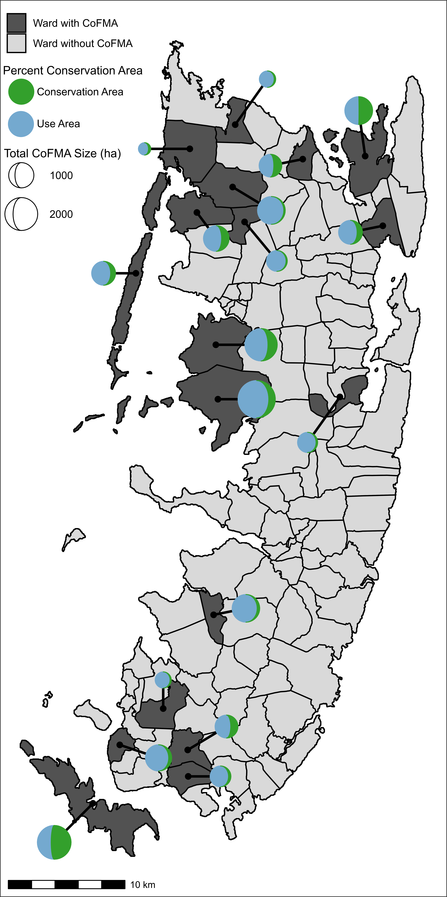
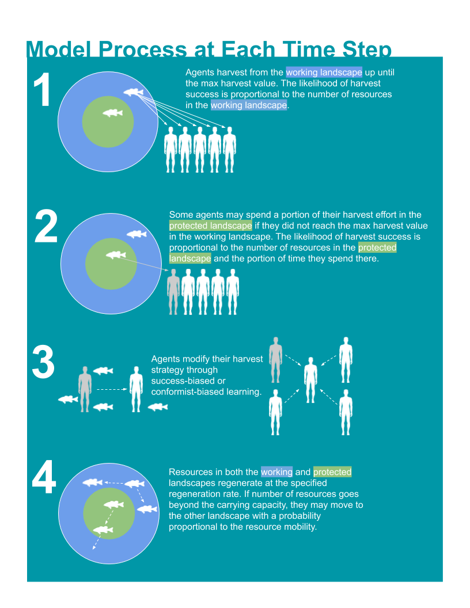

```{r setup, include=FALSE}
library(viridis)
library(knitr)
library(tidyverse)
knitr::opts_chunk$set(echo = FALSE)
```


# Project Description
The point of this project is to better understand why and how conservation spreads...or doesn't. I hope to logically test two (somewhat) competing theories using an agent-based model. Agent-based models are essentially just simple computer simulations.

## Background
This project uses Pemba Island, Tanzania as the empirical backdrop for thinking about and framing the research. 

Key things to know about the study system:

* The majority of the population is classified as "forest dependent" 
* The island has high rates (~1.5% each year and increasing) of deforestation. Near cities forest off-take is 10X sustainable rate
* Deforestation causes are local (burning, wood harvesting, logging, etc)
* There are 18 Community Forest Management Areas (CoFMAs) on the island aimed at fighting this deforestation
* CoFMAs are policed only by communities
* Each CoFMA has different proportions of resources in a "Use Area" and in a "Conservation Area"
* They are largely NOT successful. People continue to illegally harvest from Conservation Areas
* Some (8) ARE successful. Also, recently 10 new wards have started to develop CoFMAs. They are spreading across groups.

```{r map, echo=FALSE, fig.cap="Map of Pemba Island. Dark wards indicate the presence of a CoFMA. Colored circles indicate the conservation or use area allocation of each CoFMA", out.width = "50%", fig.align='center', dpi=72, fig.pos= "H"}

```
## Objectives
A prevailing theory is that in single groups, with no punishment/policing, conservation through collective action is somewhat of a lost cause. BUT when there are multiple groups, conservation can spread and become a norm across a large area. There are two slightly competing guesses as to how this works. They are not mutually exclusive.

1. Groups may observe other successful groups and copy them.
2. When groups create conservation areas, their harvest pressure spills over into the forest area of adjacent groups. This increased pressure forces the adjacent communities to also adopt conservation areas.

The first step in this research is to see if we can simulate the dynamics of a single CoFMA using an agent-based model. That's what is displayed below.


# Modeling

```{r conceptDiagram, echo=FALSE, fig.cap="Concept diagram of agent-based model scheduling under single group dynamics", out.width = "50%", fig.align='center', dpi=72, fig.pos= "H"}

```

## Five runs

```{r, echo=TRUE}
source("Abm_MultipleReplicationsPlots.R")
```

```{r, echo=TRUE,fig.keep = "last"}
abm(Runs=5,Individuals = 100,TotalCarryingCapacity=10000,
    StartPercCarryingCapacity = 0.8,
    PercProtected = 0.4, 
    ProbOfMobility = 1.00,CoopPercStart=0.95, 
    LearningStrategy = "Success Bias",
    TimeSteps=30,
    ResourceRegenerationPerTimeStep=1.1,
    harvestMax=12)
```


## Many Runs-Many Combinations
```{r, echo=TRUE}
source("MultipleReplicationsNoPlots.R")
```

### No Illegal Take
```{r, echo=TRUE,cache=TRUE}
FillData<-data.frame(PercProtected=seq(0.1,1,0.1),ResourceMobility=seq(0.1,1,0.1))
FillData<-expand.grid(PercProtected=seq(0.1,1,0.1), ResourceMobility=seq(0.1,1,0.1))
FillData$meanPayoff<-rep(NA,nrow(FillData))
FillData%<>%mutate(PercProtected=round(PercProtected,digits=1))%>%mutate(ResourceMobility=round(ResourceMobility,digits=1))


for (i in 1:nrow(FillData)){
  abmnp(Runs=3,Individuals = 100,TotalCarryingCapacity=10000,
      StartPercCarryingCapacity = 1.00,
      PercProtected = FillData[i,]$PercProtected, 
      ProbOfMobility = FillData[i,]$ResourceMobility,CoopPercStart=1.0, 
      LearningStrategy = "Success Bias",
      TimeSteps=30,
      ResourceRegenerationPerTimeStep=1.05,
      harvestMax=25)
  FillData[i,3]<-apply(FullOutput$meanPayoff[30,1:3],1,mean)  
  #print(paste0(i/nrow(FillData)*100,"%"))
}

ggplot(data=FillData, mapping=aes(x=PercProtected, y=ResourceMobility, fill= meanPayoff)) + 
  geom_tile()+scale_fill_viridis()+theme_minimal()+ylab("Resource Mobility")+
  theme(panel.grid.major = element_blank(), panel.grid.minor = element_blank(),
        plot.title = element_text( size=18, color="black",face="bold"),
        axis.title.x = element_text( size=18),
        axis.title.y = element_text( size=18),
        axis.text=(element_text(color="black", size=14)),
        legend.title = element_text(colour="black", size=18),
        legend.text = element_text( size = 14))+
  scale_x_continuous(labels = scales::percent, expand = c(0, 0))+
  scale_y_continuous( labels = scales::percent,expand = c(0, 0))+
  labs(fill = "Average Harvest\nPayoff")+
  xlab("Percent Protected")
```

### Some Illegal Take with Learning
```{r,echo=TRUE,cache=TRUE}
FillData2<-data.frame(PercProtected=seq(0.1,1,0.1),ResourceMobility=seq(0.1,1,0.1))
FillData2<-expand.grid(PercProtected=seq(0.1,1,0.1), ResourceMobility=seq(0.1,1,0.1))
FillData2$meanPayoff<-rep(NA,nrow(FillData2))
FillData2%<>%mutate(PercProtected=round(PercProtected,digits=1))%>%mutate(ResourceMobility=round(ResourceMobility,digits=1))


for (i in 1:nrow(FillData2)){
  abmnp(Runs=5,Individuals = 100,TotalCarryingCapacity=10000,
        StartPercCarryingCapacity = 1.00,
        PercProtected = FillData2[i,]$PercProtected, 
        ProbOfMobility = FillData2[i,]$ResourceMobility,CoopPercStart=0.95, 
        LearningStrategy = "Success Bias",
        TimeSteps=30,
        ResourceRegenerationPerTimeStep=1.2,
        harvestMax=25)
  FillData2[i,3]<-apply(FullOutput$meanPayoff[30,1:5],1,mean)  
  #print(paste0(i/nrow(FillData2)*100,"%"))
  
}

ggplot(data=FillData2, mapping=aes(x=PercProtected, y=ResourceMobility, fill= meanPayoff)) + 
  geom_tile()+scale_fill_viridis(limits=c(0,16),breaks=c(0,8,16))+theme_minimal()+ylab("Resource Mobility")+
  theme(panel.grid.major = element_blank(), panel.grid.minor = element_blank(),
        plot.title = element_text( size=18, color="black",face="bold"),
        axis.title.x = element_text( size=18),
        axis.title.y = element_text( size=18),
        axis.text=(element_text(color="black", size=14)),
        legend.title = element_text(colour="black", size=18),
        legend.text = element_text( size = 14))+
  scale_x_continuous(labels = scales::percent, expand = c(0, 0))+
  scale_y_continuous( labels = scales::percent,expand = c(0, 0))+
  labs(fill = "Average Harvest\nPayoff")+
  xlab("Percent Protected")
```


## Exploring Outputs

[(click!)](https://mattclarknewaccount.shinyapps.io/ABM_Output_trial/).

# Next Steps
The next step in this is to add multiple groups to the model. To test the two different guesses as to **why** conservation is spreading on the island, I will setup a virtual experiment. One version will have two groups identical to the one described above, but at each time step the groups will compare their success to the other group and adjust to better emulate the more successful group. The other version will have the same two groups, but they will share a common working landscape, so as one group abides by the protected area regulations, it causes the other group to do worse. 

