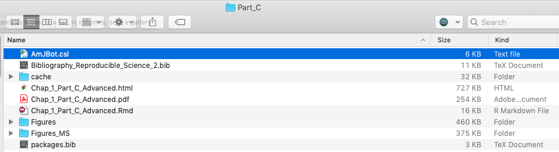
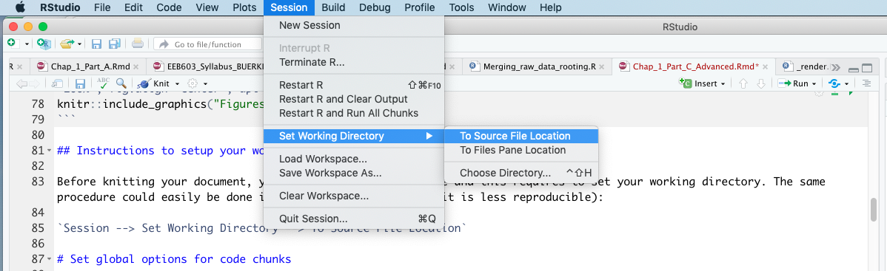

--- 
title: 'EEB 603 -- Chapter 1: Using the R Markdown language to promote Reproducible Science'
subtitle: "Part C: Advanced R and R Markdown settings"
author: "Sven Buerki"
date: "`r Sys.Date()`"
output:
  bookdown::pdf_document2:
    toc: TRUE
  bookdown::html_document2: 
    toc: TRUE
link-citations: yes
fontsize: 12pt
bibliography: [Bibliography_Reproducible_Science_2.bib, packages.bib]
csl: AmJBot.csl
---

```{r packages, echo=FALSE, warning=FALSE, include=FALSE}
library(knitr)
library(rmarkdown)
library(bookdown)
library(knitcitations)
library(formatR)
library(devtools)

#Generate BibTex citation file for all R packages used to produce report
knitr::write_bib(.packages(), file = 'packages.bib')
```


```{r setup, include=FALSE, cache=FALSE, message = FALSE}
#Load packages
library(knitr)
library(rmarkdown)
# Chunk options: see http://yihui.name/knitr/options/ ###

## Text results
opts_chunk$set(echo = TRUE, warning = TRUE, message = TRUE, include = TRUE)

## Code decoration
opts_chunk$set(tidy = TRUE, tidy.opts = list(blank = FALSE, width.cutoff = 60), highlight = TRUE)

## Caching code
opts_chunk$set(cache = 2, cache.path = "cache/")

## Plots
opts_chunk$set(fig.path = "Figures_MS/", dev=c('pdf', 'png'), dpi = 300)

## Locate figures as close as possible to requested position (=code)
#opts_chunk$set(fig.pos = "H")
```

# Learning outcomes

This tutorial is devoted to part C of chapter 1 and provides students with opportunities to learn procedures to:

- Set your working directory.
- Set global options for code chunks related to:
  + text,
  + code decoration,
  + caching,
  + plots (output format and resolution),
  + positioning figures (close to associated code chunks).

# Associated files supporting this tutorial

Although less used in part A, a set of files are provided to support teaching of material presented in this chapter. These files are deposited in the shared Google Drive at this path: 
  
  + `Reproducible_Science/Chapters/Chapter_1/Tutorial_files`

Files are as follows:

- `EEB603_Syllabus_BUERKI.Rmd`: This is the `.Rmd` file used to compile the syllabus of this class. This file provides a good source of information for the syntax and protocols described in this tutorial.
- `Bibliography_Reproducible_Science_2.bib`: This file contains references cited in `BibTeX` format. 
- `AmJBot.csl`: This citation style language (CSL) file allows formatting citations and bibliography following citation style of *American Journal of Botany*.
- `Bioinformatic workflow_PART2.pdf`: A `pdf` file containing the bioinformatic workflow taught in this class. This file will be used to learn how to incorporate a figure into R Markdown file.

# Set your working directory

Unlike R scripts where you have to set your working directory or provide the path to your files, the approach implemented in R Markdown document (`.Rmd`) automatically sets your working directory to the location of your `.Rmd` file. This procedure is done by `knitr` functions. `knitr` expects all declared files to be located in the same path as your `.Rmd` file or in a subfolder within this working directory. The main reason for this approach is to maximize portability of your R Markdown project, which is usually composed of a set of files (see Figure \@ref(fig:projstr)). 

```{r projstr, echo=FALSE, fig.cap="Snapshot of the project structure associated to part C of Chapter 1. External figures used in the document are in Figures, whereas those generated by the document are saved in Figures MS.", out.width = "100%", fig.align='center', dpi=72}

```

## Instructions to setup your working directory

Before knitting your document, you will be testing your code and this requires to set your working directory. The can be done in RStudio by clicking (see Figure \@ref(fig:setwd)):

`Session --> Set Working Directory --> To Source File Location`

```{r setwd, echo=FALSE, fig.cap="Snapshot of RStudio showing procedure to set your working directory to allow testing your code prior to knitting.", out.width = "100%"}

```

# Set global options for code chunks

To improve code reproducibility and efficiency and to follow publication requirements, it is customed to include a "code chunk" at the beginning of your `.Rmd` file to set global options applying to the whole document. Those settings are related to the following elements of your code:

- text results.
- code decoration.
- caching code.
- plots (or figures).
- positioning figures.

These general settings will be set using the `opts_chunk()` function implemented in `knitr` [@R-knitr]. The following website contains valuable information on code chunk options:

- https://yihui.name/knitr/options/

## The opts_chunk$set() function

The `knitr` function `opts_chunk$set()` is used to change the default global options in an `.Rmd` document. 

Before starting, a few special notes should be known on the options:

1. Chunk options must be written in one line; no line breaks are allowed inside chunk options.
2. Avoid spaces and periods (`.`) in chunk labels and directory names.
3. All option values must be valid R expressions just like how we write function arguments.

Here we will be discussing each part of the settings individually, but those will have to be merged into one code chunk in your document entitled `setup` (please see below for more details). 

### Text results

This section deals with settings related to text results generated by code chunks.

Please find below an example of options that could be applied across code chunks:

```{r echo= TRUE, eval=FALSE}
# Setup options for text results
opts_chunk$set(echo = TRUE, warning = TRUE, message = TRUE, include = TRUE)
```

#### Explanations of the text results options 

- `echo = TRUE`: Include all R source codes in the output file.
- `warning = TRUE`: Preserve warnings (produced by `warning()`) in the output like we run R code in a terminal.
- `message = TRUE`: Preserve messages emitted by `message()` (similar to warning)
- `include = TRUE`: Include all chunk outputs in the final output document.

If you want some of the text results to have different options, please adjust those in their specific code chunks. This comment is valid for all the other general settings.

### Code decoration

This section deals with settings related to code decoration (i.e. how it is outputted in the final `pdf` document) generated by code chunks.

Please find below an example of options that could be applied across code chunks:

```{r echo= TRUE, eval=FALSE}
# Setup options for code decoration
opts_chunk$set(tidy = TRUE, tidy.opts = list(blank = FALSE, width.cutoff = 60), highlight = TRUE)
```

#### Explanations of the code decoration options 

- `tidy = TRUE`: Use `formatR::tidy_source()` to reformat the code. Please see `tidy.opts` below.
- `tidy.opts = list(blank = FALSE, width.cutoff = 60)`: This provides a list of options to be passed to the function determined by the `tidy` option. Here we format the code to avoid blank lines and with a width cutoff of 60 characters. 
- `highlight = TRUE`: This highlights the source code.

### Caching code

To compile your `.Rmd` document faster (especially if you have computing intensive tasks), you can cache the output of your code into files associated to each of your code chunks. This process allows compute intensive chunks to be saved and the output used later without being re-run. 

The *knitr* package has options to only evaluate cached chunks when necessary, but this has to be set by users. Such procedure creates a unique MD5 digest (= a data storage technique) of each chunk to track when changes are present. When the option `cache=TRUE` (there are other, more granular settings; see below), the chunk will only be evaluated in the following scenarios:

- There are no cached results (either this is the first time running or the results were moved/deleted).
- The code chunk has been modified.

The following code allows implementing this procedure to your document:

```{r echo= TRUE, eval=FALSE}
# Setup options for code cache
opts_chunk$set(cache = 2, cache.path = "cache/")
```

#### Explanations of the caching code options 

- Besides `TRUE` and `FALSE` for the chunk option `cache`, advanced users can also consider more granular cache by using numeric values for `cache = 0, 1, 2, 3`. `0` means `FALSE`, and `3` is equivalent to `TRUE`. For `cache = 1`, the results of the computation are loaded from the cache, so the code is not evaluated again, but everything else is still executed, such the output hooks and saving recorded plots to files. For `cache = 2` (used here), it is very similar to `1`, and the only difference is that the recorded plots will not be re-saved to files when the plot files already exist, which might save some time when the plots are big.
- `cache.path = "cache/"`: Directory where cache files will be saved. You don't have to create the directory before executing the code, it will be created automatically by *knitr*.  

### Plots

Plots are a major element of your research and they are at the core of your figures. We can take advantage of options implemented in the `knitr` package to output plots meeting publication requirements. This will save precious time during the writing phase of your research (= no need to fiddle with the size and resolution of figures to meet journal policies).

Please find below an example of options that could be applied across code chunks:

```{r echo= TRUE, eval=FALSE}
# Setup options for plots
opts_chunk$set(fig.path = "Figures_MS/", dev=c('pdf', 'png'), dpi = 300)
```

#### Explanations of the caching plots options 

- `fig.path = "Figures_MS/""`: Set directory to save figures generated by the R Markdown document. As above, this folder doesn't need to exist prior to executing the code chunks. Files will be save based on code chunk title and assigned figure number.
- `dev = c('pdf', 'png')`: Save figures in both `pdf` and `png` formats.
- `dpi = 300`: The DPI (dots per inch) for bitmap devices (dpi * inches = pixels). Please look at publishing requirements to set this parameter appropriately.

It is worth noting that you might be using external figures in your `.Rmd` document. To avoid confusions between figures generated by the `.Rmd` document and those coming from outside, it is best practice to have them saved in two different subfolders (see Figure \@ref(fig:projstr) for more details). 


#### Additional plots options

Some journals have specific requirements on figure dimensions. You can easily set these by using the following option:

- `fig.dim`: (NULL; numeric) if a numeric vector of length 2, it gives `fig.width` and `fig.height`, e.g., `fig.dim = c(5, 7)`.

### Positioning figures

Positioning figures close to their code chunks is critical and can get sorted by adding another `opts_chunk$set()` code line in your `setup` R code chunk. This is done by invoking the `fig.pos` argument and setting it to `"H"`. **Warning:** Setting this argument might generate errors when documents are knitted as `pdf` documents. If it happens, please comment this line using `#` and knit again.  

```{r echo= TRUE, eval=FALSE}
## Locate figures as close as possible to requested position (=code)
opts_chunk$set(fig.pos = "H")
```

## Applying global changes to all code chunks

In this section, we will collate all global settings discussed above into a code chunk entitled `setup`, which will be placed under the YAML metadata section. In addition to containing the global settings, it is advisable to also include a code section devoted to loading required R packages in the `setup` code chunk. 

Please find below the code for the `setup` code chunk based on the options presented above:

```{r echo= TRUE, eval=FALSE}
#Load packages

## Add any packages specific to your code
library("knitr")
library("bookdown")

# Chunk options: see http://yihui.name/knitr/options/ ###

## Text results
opts_chunk$set(echo = TRUE, warning = TRUE, message = TRUE, include = TRUE)

## Code decoration
opts_chunk$set(tidy = TRUE, tidy.opts = list(blank = FALSE, width.cutoff = 60), highlight = TRUE)

## Caching code
opts_chunk$set(cache = 2, cache.path = "cache/")

## Plots
opts_chunk$set(fig.path = "Figures_MS/", dev=c('pdf', 'png'), dpi = 300)

## Locate figures as close as possible to requested position (=code)
opts_chunk$set(fig.pos = "H")
```

### Settings of the `setup` R code chunk 

When inserting the above code into an R code chunk, please set the options of the chunk as follows:

- `setup`: Unique ID of the code chunk.
- `include = FALSE`: Nothing will be written into the output document, but the code will be evaluated and plot files will be generated (if there are any plots in the chunk).
- `cache = FALSE`: Code chunk will not be cached (see above for more details).
- `message = FALSE`: Messages emitted by `message()` will not be preserved. 

Options (and their associated arguments) in the code chunk have to be separated by commas.

# An exercise to work on learning objectives 

Please conduct the above exercise to get accustomed with the material presented in the tutorial. This exercise is divided into six steps as follows:

1. Open RStudio, create and save a `.Rmd` document (**Tip:** save the file in a new folder).
2. Set your working directory according to file location.
3. Insert an R code chunk (using the `Insert`  button) and entitle it `setup`. This code chunk will be used to define the global settings for the following options as implemented in the `opts_chunk$set()` function:
  - Text results.
  - Code decoration.
  - Caching code.
  - Plots.
  - Positioning of figures.
4. Use the R code provided below (which generates a plot) to learn more about the effect of global settings on code outputs.
5. Once the file is completed, compile your document using the `Knit`  button. Please pay attention to the outputs in your folder.
6. Use the `bookdown` `\@ref()` function to cite your figure/plot in the text.

## An R code to generate a plot & cross-reference it in text

The R code provided below is associated to step 4 of the exercise and it produces the plot displayed in Figure \@ref(fig:PlotFig).

```{r PlotFig, echo=FALSE, results="hide", fig.cap="Plot of y ~ x."}
# Generate a set of observations (n=100) that have a normal distribution
x <- rnorm(100)

# Add a small amount of noise to x to generate a new vector (y)
y <- jitter(x, 1000)

# Plot y ~ x
plot(x, y)
```

To get there:
1. Insert an R code chunk (using the `Insert`  button) and set the following options and associated arguments:

- `Plot`: Unique ID of code chunk.
- `fig.cap="Plot of y ~ x."`: Figure caption.
- `fig.show="asis"`: Figure display.
- `out.width = '100%'`: Figure width on the page.

2. Enter the following R code in the code chunk.

```{r Plot2, eval = FALSE}
# Generate a set of observations (n=100) that have a normal distribution
x <- rnorm(100)

# Add a small amount of noise to x to generate a new vector (y)
y <- jitter(x, 1000)

# Plot y ~ x
plot(x, y)
```

3. Test your code to make sure it does what it is supposed to do (using the `Run`  button).
4. Go to step 5 above and complete the exercise.

# References

<div id="refs"></div>

# (APPENDIX) Appendix {-}

# Appendix 1

Citations of all R packages used to generate this report. 

```{r generateBibliography, results="asis", echo=FALSE, warning = FALSE, message=FALSE}
library("knitcitations")
cleanbib()
options("citation_format" = "pandoc")
read.bibtex(file = "packages.bib")
``` 

# Appendix 2

Version information about R, the operating system (OS) and attached or R loaded packages. This appendix was generated using `sessionInfo()`.

```{r eval=T, echo=F, warning = FALSE, message=FALSE}
sessionInfo()
```
